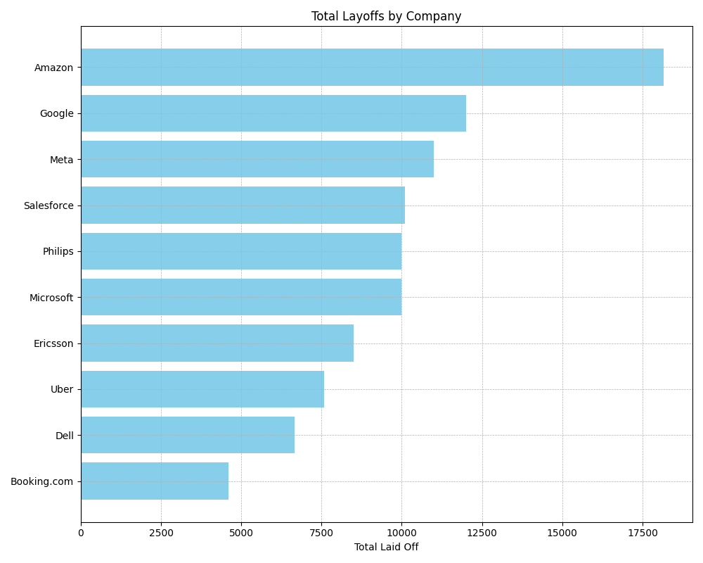
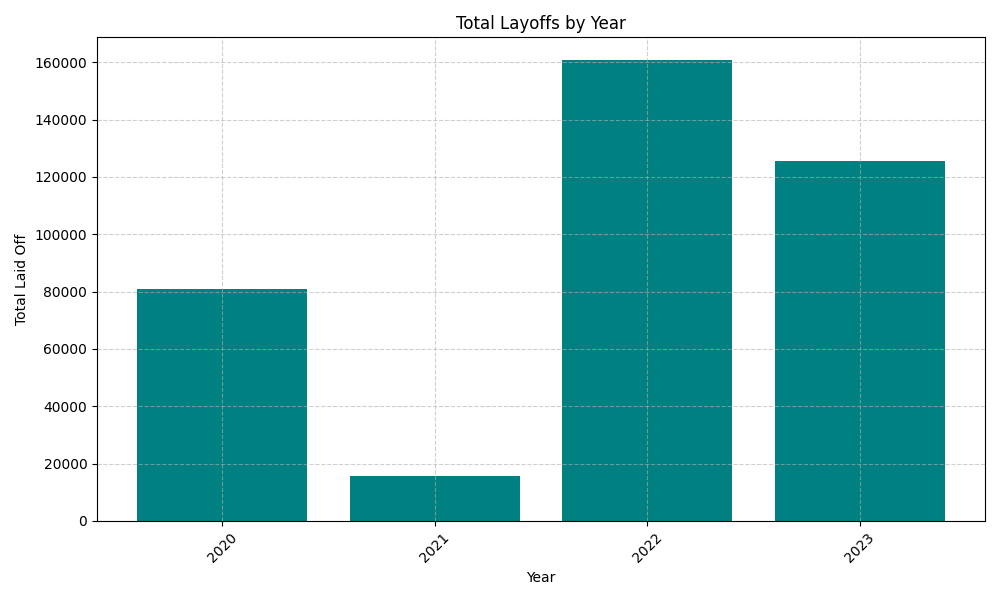
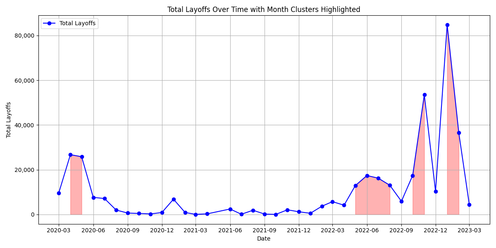
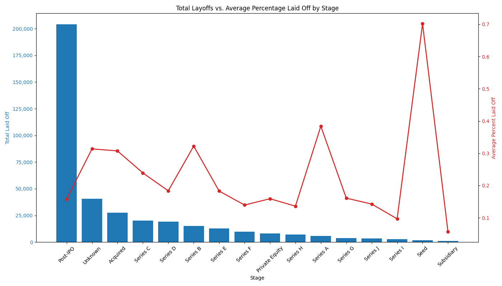

# Analyzing Global Layoffs with SQL


## Introduction
This project explores global layoffs data using a series of SQL queries to extract insights and trends. The dataset spanning the COVID-19 pandemic (2020–2023), a period that saw significant workforce disruptions. This provided an opportunity to analyze how the pandemic influenced workforce reductions across industries, countries, and company stages. The analysis examines overall trends, high-impact layoffs, and layoffs by company stage to understand both the total number of layoffs and their relative impact on companies of different sizes and stages.  

Explore the SQL queries used the analysis here: [EDA Files Folder](/EDA/)

## Data Cleaning and Preparation
Before performing the analysis, several data cleaning tasks were executed in SQL to ensure the dataset was accurate and consistent:
- **Removed duplicates:** Ensured that no duplicate records exist in the dataset.
- **Standardized the data:** Standardized data formats and naming conventions for consistency.
- **Fixed null values:** Addressed missing data to enhance the accuracy of the analysis.
- **Removed irrelevant rows and columns:** Excluded data that did not contribute valuable insights.

Explore the SQL queries used to clean the data here: [Date Cleaning Files Folder](/data_cleaning/)

## Background
Data was obtained from [Alex Freberg's SQL Course](https://github.com/AlexTheAnalyst/MySQL-YouTube-Series/blob/main/layoffs.csv). It contains detailed layoff information
from across the world between March 11, 2020 and March 6, 2023.

### The questions I wanted to answer through my SQL queries were:
- What are the overall trends in layoffs over time?
- Which companies, industries, countries, and time periods experienced the highest layoffs?
- How do layoffs vary in terms of absolute numbers versus the proportion of the workforce affected?
- Are there identifiable clusters or seasonal patterns in the layoffs?
- How does the impact differ across company stages (e.g., Seed vs. Post-IPO)?

## Tools Used
- **SQL**: For querying and aggregating layoff data.
- **MySQL**: The database management system selected to store and manage world layoff data.
- **Python (Matplotlib & Seaborn)**: For generating visualizations.
- **Visual Studio Code:** The primary tool for writing and running SQL queries, as well as managing the database.
- **Git & GitHub:** Utilized for version control and sharing my SQL scripts and analysis, making it easier for collaboration and project tracking.

## The Analysis

### Query 1: Summary Statistics

**Query 1a: Maximum Layoffs and Percentage Laid Off**  
To gauge the scale of workforce reductions, this query retrieves the highest number of employees laid off in a single event along with the maximum percentage of the workforce that was affected. This helps understand the the extreme cases within the dataset.

```sql
SELECT MAX(total_laid_off), MAX(percentage_laid_off)
FROM world_layoffs.layoffs_staging2;
```
Results Breakdown:

**Maximum layoffs**: 12,000 employees <br>
**Maximum percentage laid off**: 100%

**Query 1b: Earliest and Latest Layoff Dates**  
To establish the dataset's timeframe, this query computes the earliest and latest layoff dates. Understanding the timeframe is crucial for contextualizing subsequent analysis.

```sql
  SELECT MIN(`date`), MAX(`date`)
  FROM world_layoffs.layoffs_staging2;
  ```
  Results Breakdown:

**Earliest layoff date**: March 11, 2020 <br>
**Latest layoff date**: March 6, 2023

### Query 2: High Impact Layoffs Queries

#### Query 2a: Analyzing Financial Size of Companies with 100% Layoffs
This query filters for companies that have laid off 100% of their workforce and orders them by the funds they raised. The goal is to investigate if well-funded companies are also prone to complete workforce reductions.

```sql
SELECT *
FROM world_layoffs.layoffs_staging2
WHERE percentage_laid_off = 1
ORDER BY funds_raised_millions DESC;
```
Results Breakdown:

The top result shows that Britishvolt, a company with substantial funding (approximately $2.4B), experienced 100% layoffs before going out of business.

### Query 2b: Analyzing Total Employees Laid Off in 100% Layoffs
This query again filters for 100% layoffs but orders the results by the total number of employees laid off. The aim is to understand whether companies with a larger workforce also experience complete layoffs.

```sql
SELECT *
FROM world_layoffs.layoffs_staging2
WHERE percentage_laid_off = 1
ORDER BY total_laid_off DESC;
```
Results Breakdown:

The query shows that Katerra, with a significant total of 2,434 employees laid off, indicates that even companies with a large amount of employees can face complete workforce reductions.

### Query 3: Identify the Companies with the Highest Total Layoffs
This query aggregates the total number of layoffs for each company and orders the results in descending order, limiting the output to the top 10 companies. The goal is to identify which companies experienced the most significant workforce reductions during this time period.

```sql
SELECT company, SUM(total_laid_off)
FROM world_layoffs.layoffs_staging2
GROUP BY company
ORDER BY 2 DESC
LIMIT 10;
```
Results Breakdown:

Amazon leads with 18,150 total layoffs.
Google follows with 12,000 layoffs, and Meta with 11,000 layoffs.
These results indicate that even some of the largest and most profitable tech companies had to make substantial workforce cuts.


*Bar graph visualizing the top 10 companies with the most total layoffs*

### Query 4: Identify the Industries with the Highest Total Layoffs
This query aggregates the total layoffs by industry (ignoring null values) and orders the results in descending order. The goal is to identify which sectors experienced the largest workforce reductions during the period analyzed.

```sql
SELECT industry, SUM(total_laid_off)
FROM world_layoffs.layoffs_staging2
WHERE industry IS NOT NULL
GROUP BY industry
ORDER BY 2 DESC;
```
Results Breakdown: <br>

- **Consumer**: 45,182 layoffs <br>
- **Retail**: 43,613 layoffs <br>
- **Other**: 36,289 layoffs <br>
- Additional industries such as Transportation, Finance, and Healthcare also show significant numbers. <br>

Consumer and Retail industries had the most layoffs. This would make sense as this time period coincided with  COVID-19, which significantly disrupted businesses reliant on in-person interactions.

### Query 5: Layoffs by Country
This query aggregates the total layoffs for each country, ordering the results in descending order. The aim is to determine which countries experienced the most significant workforce reductions. This information highlights global disparities and can indicate broader economic shifts and challenges during the analyzed period.

```sql
SELECT country, SUM(total_laid_off)
FROM world_layoffs.layoffs_staging2
GROUP BY country
ORDER BY 2 DESC;
```
Results Breakdown:

- The United States leads with 256,559 layoffs.
- India and the Netherlands follow, with 35,993 and 17,220 layoffs respectively.
- These figures help to illustrate regional differences in how layoffs impacted various countries.

### Query 6: Layoffs by Year
This query aggregates layoffs on an annual basis by extracting the year from the date field and summing up the total layoffs for each year. The results are ordered in descending order by year to quickly identify the most recent trends and compare annual changes. This helps in understanding how layoffs have fluctuated over the 3-year time period.

```sql
SELECT YEAR(`date`), SUM(total_laid_off)
FROM world_layoffs.layoffs_staging2
GROUP BY YEAR(`date`)
ORDER BY 1 DESC;
```

Results Breakdown:

- 2022 recorded the highest number of layoffs with 160,661.
- 2023 (with only about two months of data) shows 125,677 layoffs, suggesting that it could be even more than the number of layoffs in 2022 if the trend continues.
- 2021 saw a significant drop (15,823 layoffs) compared to 2020's 80,998 layoffs.
- The data indicates that after a dip in 2021, layoffs surged in 2022 and early 2023, possibly intensifying job market competition.


*Bar graph visualizing total layoffs by year*

### Query 7: Layoffs by Month (Seasonality & Clusters)
This query aggregates layoffs on a month-by-month basis by extracting the year and month from the date field. The goal is to identify seasonal trends or clustered periods of layoffs. By analyzing these monthly totals, we can detect if there are any patterns where layoffs occur certain periods of the year. These patterns are particularly useful for understanding when job market competition might intensify.

```sql
SELECT SUBSTRING(`date`, 1, 7) AS `MONTH`, SUM(total_laid_off)
FROM world_layoffs.layoffs_staging2
WHERE SUBSTRING(`date`, 1, 7) IS NOT NULL 
GROUP BY `MONTH`
ORDER BY 1 ASC;
```
Results Breakdown:

- The data reveals clusters of high layoffs during certain years, typically happening in 3-4 month clusters.
- For example, in 2020, months like April and May show significant spikes. This is likely due to the start of the mandated quarantine during COVID
- In 2022 there are notable surges in May-August and October-November.
- In 2023 there is a large spike in Jan-Feb.
- These clusters suggest that after a period of low layoffs, a sudden spike may signal further layoffs in the near future and maintained at a high level for a few months.


*Bar graph visualizing month-by-month total layoffs*

### Query 8: Layoffs by Company Stage

#### 8a: Total Layoffs by Company Stage
This query aggregates total layoffs by company stage, filtering out null stages, and orders the results in descending order. It provides insight into which funding stages experience the largest workforce reductions. 

```sql
SELECT stage, SUM(total_laid_off) AS 'Total Laid Off'
FROM world_layoffs.layoffs_staging2
WHERE stage IS NOT NULL
GROUP BY stage
ORDER BY 2 DESC;
```

Results Breakdown:

Here are the top 5 company stages with the most layoffs:
- **Post-IPO**: 204,132 layoffs
- **Unknown**: 40,716 layoffs
- **Acquired**: 27,576 layoffs
- **Series C**: 20,017 layoffs
- **Series D**: 19225 layoffs

Post-IPO companies account for the most layoffs (204,132), likely due to public market pressures. Acquired companies have the third highest number of layoffs, possibly due to restructuring. Late-stage startups (Series B–D) also see significant layoffs, suggesting challenges in scaling profitably.

#### 8b: Average Percentage of Layoffs by Company Stage
Since Post-IPO companies are typically larger, they may show high total layoffs, but their overall workforce reduction (in percentage terms) could be lower. This query calculates the average percentage of layoffs by company stage, offering a clearer picture of the relative impact on each stage.

```sql
SELECT stage, AVG(percentage_laid_off) AS 'Average Percent Laid Off'
FROM world_layoffs.layoffs_staging2
WHERE percentage_laid_off IS NOT NULL
AND stage IS NOT NULL
GROUP BY stage
ORDER BY 2 DESC;
```
Results Breakdown:

- **Seed**: ~70% average layoffs
- **Series A**: ~38% average layoffs
- **Series B**: ~32% average layoffs
- **Acquired**: ~31% average layoffs
- **Post-IPO**: ~16% average layoffs
- Other stages follow accordingly, with Subsidiaries showing the lowest impact (~5.7%).

The analysis shows that early-stage companies, particularly those at the seed level, experience the most severe proportional layoffs, reflecting their inherent volatility. In contrast, while Post-IPO companies report the highest total layoffs, their average percentage is much lower, indicating that larger firms can better absorb these reductions. Early-stage companies, such as those in Series A and B, face significant risks, and restructuring efforts in Acquired firms contribute to moderate layoff percentages, while later-stage companies and subsidiaries tend to be more stable with the lowest proportional layoffs.


*Chart visualizing Total Layoffs vs. Average Percentage Laid Off by Company Stage*

# What I Learned
This project provided valuable hands-on experience in SQL and data visualization, reinforcing key technical skills:
- **SQL for Data Analysis**: Improved my ability to write optimized queries for filtering (WHERE), sorting (ORDER BY), and aggregating data (GROUP BY, SUM(), AVG()) to extract meaningful workforce trends.
- **Python for Data Visualization**: Gained additional practice using Python libraries like Matplotlib to create visual representations of SQL query results, making trends and patterns easier to interpret.
- **Analytical Thinking**: Refined my problem-solving approach by translating real-world questions into insightful SQL queries and impactful data visualizations.

# Conclusion
## Insights
This analysis uncovered several key takeaways regarding workforce reductions:
- Layoffs occur in clustered periods rather than uniformly over time.
- Post-IPO companies had the highest total layoffs, but early-stage startups faced more severe proportional reductions, highlighting their financial instability.
- Consumer and Retail industries were hit the hardest, likely due to the impact of COVID-19, which disrupted businesses reliant on in-person interactions and shifted consumer behavior.
- The surge in layoffs in 2022 and early 2023 suggests that job seekers may face increased competition due to a larger displaced workforce.

## Final Thoughts
This project provided an opportunity to apply SQL techniques to a real-world dataset while uncovering meaningful trends in workforce reductions. The findings help contextualize how layoffs impact different industries, company stages, and geographies, making it easier to anticipate broader job market trends.

The time period analyzed (2020–2023) coincided with the COVID-19 pandemic, which significantly influenced workforce reductions across various industries. Understanding this context helps frame the data within broader economic and societal shifts.

By integrating SQL queries with Python visualizations, I was able to explore workforce trends more effectively and develop a more comprehensive understanding of layoff patterns over time. For job seekers like myself, understanding layoff trends can help anticipate market fluctuations and navigate career decisions more effectively.